# Conversation 492a2d6d

**Date**: June 10, 2026 at 09:32 AM
**Turns**: 18
**Source**: [Gemini Chat](https://gemini.google.com/app/492a2d6db344b68a)

---

## Turn 1

### 👤 User

完全可以绕开 Arduino 和 PlatformIO。
针对你的疑问，最直接的回答是：ESP-IDF 不是 Arduino 框架。恰恰相反，ESP32 的 Arduino 核心是建立在 ESP-IDF 之上的一层“外壳”。
如果你厌倦了臃肿的集成环境，怀念开发 STM32 HAL 库时那种从底层掌控全流程的清爽感，直接使用原生的 ESP-IDF 是最适合你的路线。
### 为什么选择原生 ESP-IDF？
1. 纯粹的 C/C++ 与 FreeRTOS： ESP-IDF 是乐鑫官方提供的物联网开发框架，底层直接调度 FreeRTOS。它的开发逻辑与 STM32 HAL 库非常类似，你需要直接查阅官方手册，配置外设寄存器、设定硬件定时器、配置 DMA 通道和中断回调，而不是调用 Arduino 那些被过度封装的黑盒 API。
2. 构建与编译系统的自由： 原生 ESP-IDF 采用 CMake 和 Ninja 作为构建系统。这意味着你可以彻底抛弃 PlatformIO。你完全可以在终端里通过简单的 `idf.py build` 和 `idf.py flash` 指令完成编译和烧录。
3. 编辑器回归本质： 在这种工作流下，VS Code 可以回归它作为一个纯粹文本编辑器的本分。配合你习惯的 Vim 键位绑定，再只需安装一个官方的 C/C++ 语法高亮插件即可，无需加载任何沉重的 IDE 扩展。
4.
极佳的硬件性能压榨： 课程手册中特别提到，如果对摄像头图像处理性能有极高要求，推荐使用 C 语言路径，因为 `ESP-IDF Camera Driver` 更加成熟 。手册也明确指出，ESP-IDF 提供 FreeRTOS 及底层驱动，高级用户可直接使用 。在处理 ESP32-S3 的 OV2640 图像采集和 DMA 传输时，原生 ESP-IDF 能让你把内存和时钟频率压榨到极限。
### 你的专属开发路径建议
根据课程要求，你需要同时开发 ESP32 (V1) 运动控制核心和 ESP32-S3 视觉感知核心 。如果你选择这条“硬核”路线，你的工作流将变成：
* 环境： 在你的 Linux 系统下安装 ESP-IDF 工具链。
* 代码编写： 使用纯净版 VS Code 编辑代码。
* 编译与烧录： 在终端执行 `idf.py build`、`idf.py flash`、`idf.py monitor`。
* 控制板 (ESP32 V1)： 使用 ESP-IDF 的 `mcpwm` (电机控制 PWM) 外设直接驱动 AT8236，使用 `adc_oneshot` 接口读取五路光电传感器。
* 视觉板 (ESP32-S3)： 直接移植并修改乐鑫官方的 `esp32-camera` 纯 C 库，配置 I2S/Camera 总线和 DMA 获取图像。
需要我现在为你梳理在 Linux 环境下配置 ESP-IDF 纯命令行工具链的具体步骤吗？
像你在上个对话里说的，带我配置esp-idf环境

### 🤖 Assistant

太棒了，欢迎回到真正掌控硬件的极客开发模式。在 Linux 下配置纯命令行的 ESP-IDF 环境非常直观，整个过程就像搭积木一样清晰。
以下是在基于 Debian/Ubuntu 的 Linux 系统下（如果你使用的是 Arch 或 Fedora，包管理器和部分依赖名称会有细微差别）配置 ESP-IDF 纯命令行工作流的完整步骤：

### 第一步：安装系统依赖
ESP-IDF 的编译系统依赖于 CMake、Ninja 以及 Python 等工具。首先需要确保你的系统里安装了这些基础软件包。
打开终端，运行以下命令：

```bash
sudo apt-get update
sudo apt-get install git wget flex bison gperf python3 python3-venv cmake ninja-build ccache libffi-dev libssl-dev dfu-util libusb-1.0-0

```

### 第二步：克隆 ESP-IDF 官方源码
我们需要把乐鑫的官方框架克隆到本地。建议将它放在你的主目录下的一个专属文件夹中（例如 `~/esp`）。为了保证稳定性，我们选择克隆当前的主流稳定分支（如 `release/v5.2`），并且**必须包含子模块**。

```bash
mkdir -p ~/esp
cd ~/esp
git clone -b release/v5.2 --recursive https://github.com/espressif/esp-idf.git

```
*注：由于包含了庞大的子模块，这一步可能需要几分钟的时间，具体取决于你的网络状况。*

### 第三步：安装特定芯片的工具链
源码下载完成后，需要运行自带的安装脚本。这个脚本会自动为你下载对应芯片（ESP32、ESP32-S3 等）的交叉编译器，并配置好隔离的 Python 虚拟环境，**完全不会污染你的 Linux 系统环境**。
我们要同时开发 ESP32 和 ESP32-S3，因此可以直接指定这两个目标（或者干脆全部安装）：

```bash
cd ~/esp/esp-idf
# 只安装 ESP32 和 ESP32-S3 的工具链，节约空间
./install.sh esp32,esp32s3

```

### 第四步：配置串口权限（极其重要）
在 Linux 下，普通用户默认没有权限向串口设备（如 `/dev/ttyUSB0` 或 `/dev/ttyACM0`）写入数据。为了让你能正常烧录程序，必须将你的当前用户加入到 `dialout` 组。

```bash
sudo usermod -a -G dialout $USER

```
**注意：执行完这条命令后，你需要注销当前用户并重新登录，或者直接重启电脑，权限组设置才会生效。**

### 第五步：设置环境变量
为了能在终端里的任何地方使用 `idf.py` 命令，你需要激活 ESP-IDF 的环境变量。乐鑫提供了一个 `export.sh` 脚本来完成这件事。
每次打开新终端时，你可以手动执行：

```bash
. ~/esp/esp-idf/export.sh

```
*(注意：最前面有一个点和空格，等同于 source ~/esp/esp-idf/export.sh)*
**极客推荐配置：设置 Alias (别名)**
为了避免每次都要敲这么长的一行，建议在你的 `.bashrc` 或 `.zshrc` 文件末尾添加一个别名。

```bash
alias get_idf='. $HOME/esp/esp-idf/export.sh'

```
以后每次打开终端准备敲代码时，只需要输入 `get_idf`，环境变量就瞬间配置完毕了，非常清爽。

### 第六步：跑通第一个项目 (Hello World)
环境配置好后，让我们直接用 CLI 编译一个工程，验证全链路是否打通。

```bash
get_idf

```
如果一切顺利，终端里将跳过编译信息，显示烧录进度条，随后进入监视器界面，你将看到一行行的 "Hello world!" 打印出来。
*(提示：要退出监视器，请按下 Ctrl + ] )*

## Turn 2

### 👤 User

呃，等等，我没看明白，你的回答里面似乎没有涉及到vscode，是我们用不到它吗

### 🤖 Assistant

当然要用 VS Code。前文没有提及它，是因为在原生的命令行开发流中，**VS Code 已经退回到了纯粹的代码编辑器角色，不再负责接管编译、链接和烧录的底层工作。**
这种模式下，你的工作流有着清晰的责任划分：

- **VS Code：** 专注于代码编写、语法高亮、代码跳转，配合你的 Vim 快捷键进行高效文本编辑。
- **终端（Linux 终端或 VS Code 集成终端）：** 负责执行环境激活 (`get_idf`) 和构建指令 (`idf.py`)。
为了在纯命令行流下获得最佳的 VS Code 体验，你需要进行以下极简配置，以解决 C/C++ 头文件报错（红波浪线）的问题，同时坚决不安装臃肿的完整版 ESP-IDF 插件。

### 第一步：启动 VS Code 与基础插件

1. 在终端中进入你的项目目录，输入 `code .` 打开 VS Code。
2. 进入插件市场，仅需确保安装了以下基础插件：
  - **C/C++ (Microsoft)** 或 **clangd**：用于 C/C++ 语法高亮和代码补全。
  - **Vim**：用于你的快捷键映射。
3. **请勿安装**官方的 "Espressif IDF" 插件，它会试图接管整个环境，破坏纯命令行的清爽感。

### 第二步：配置 IntelliSense (代码自动补全)
原生 ESP-IDF 项目基于 CMake。要让 VS Code 准确识别 FreeRTOS 和 ESP-IDF 的底层 API（如 `mcpwm` 或 `adc_oneshot`），最优雅的做法是使用 CMake 生成的 `compile_commands.json` 文件，而不是手动去配置冗长的头文件路径。

```bash
get_idf
idf.py build

```

```json
    {
        "configurations": [
            {
                "name": "ESP-IDF",
                "compilerPath": "",
                "compileCommands": "${workspaceFolder}/build/compile_commands.json",
                "cStandard": "c11",
                "cppStandard": "c++17"
            }
        ],
        "version": 4
    }
    ```

保存该文件后，VS Code 的 C/C++ 插件会自动读取 `compile_commands.json` 中的编译参数。所有的官方 API 报错红线都会消失，并且你可以使用 `F12` 顺畅地跳转到乐鑫官方底层库的源码中查看寄存器定义和函数实现。

### 日常开发流程总结
配置完成后，你的日常开发将遵循这个极简循环：
1.  在 VS Code 的编辑器窗口中敲击代码。
2.  使用快捷键 `Ctrl + \`` 唤出 VS Code 的集成终端。
3.  在集成终端里输入 `get_idf` 激活环境（仅需每次打开终端执行一次）。
4.  输入 `idf.py build flash monitor` 编译代码、烧录到板子上，并直接在终端面板查看串口日志。

```

## Turn 3

### 👤 User

sudo apt-get install git wget flex bison gperf python3 python3-venv cmake ninja-build ccache libffi-dev libssl-dev dfu-util libusb-1.0-0 这行命令里，像git、python3我肯定已经装过了，如果再install一次，它会检测到我已经装过然后跳过这一项吗，还是不管不顾地安装

### 🤖 Assistant

它会非常聪明地检测，**绝对不会不管不顾地盲目覆盖安装**。
作为 Linux Mint 的核心包管理器，`apt` 在执行这行命令时会先做一次状态核对。对于列表里的每一个软件包，它会进行如下处理：

1. **已安装且是最新版（比如你的 git 和 python3）：** 它会直接跳过，并在终端里甩给你一行提示，比如 `git is already the newest version`，不会进行任何下载或覆盖写入。
2. **已安装但软件源里有新版本：** 它会顺手帮你把这个包升级到最新版。
3. **完全没安装过（比如可能没装过的 gperf 或 ninja-build）：** 正常下载并安装。
所以，在 Linux 下配置开发环境时，最省心、最标准的做法就是**直接把官方文档里那一长串依赖命令整行复制、粘贴、回车**。
你完全不需要费心去把已经装过的包一个个手动剔除，放心地交给包管理器，它会自动帮你把缺失的环境拼图补齐。

## Turn 4

### 👤 User

应该不会造成什么环境冲突吧——话说它们占多大内存呢

### 🤖 Assistant

放心，**绝对不会造成环境冲突**。乐鑫在设计 ESP-IDF 时，非常注重对宿主机环境的保护。
这里的底层逻辑是：我们刚才用 `apt` 安装的，只是一些系统级的**通用构建工具**（比如 `cmake`、`ninja`）和**接口库**（比如 `libusb`）。它们就像是 Linux 系统的通用扳手和螺丝刀，本身就是标准工具，不会和你的任何现有软件打架。
真正容易引发冲突的“危险分子”——比如特定版本的交叉编译器（GCC for Xtensa）、特定版本的 Python 依赖包——**ESP-IDF 根本不会把它们装到你的 Linux 系统全局目录里**。
当你在执行 `./install.sh esp32,esp32s3` 时，它会巧妙地做两件事：

1. **隔离工具链：** 它会把编译器下载到你主目录下的一个隐藏文件夹里（通常是 `~/.espressif/`）。
2. **隔离 Python 环境：** 它会利用我们刚刚安装的 `python3-venv`，在本地创建一个独立的 Python 虚拟环境。
这就是为什么你每次开发前都需要执行 `get_idf`（也就是运行 `export.sh`）。这个脚本的作用，就是临时把你当前的这个终端窗口“重定向”到那个隔离的目录里。一旦你关掉这个终端，一切又恢复原样，你的 Linux Mint 系统依然干干净净。

### 关于占用空间（存储空间/硬盘）
这里你应该是指硬盘占用。整个环境搭下来，大概需要准备 **3 GB 到 4 GB** 的硬盘空间。具体分布如下：

- **系统依赖（刚刚那串 apt 命令）：** 非常小。如果你已经有了 Git 和 Python，剩下的工具加起来可能也就 **100多 MB**。
- **ESP-IDF 官方源码（git clone）：** 这是一个大头。因为包含了大量第三方库的子模块（比如 FreeRTOS、mbedTLS 等），克隆下来大概会占 **1.5 GB 到 2 GB**。
- **编译工具链（install.sh）：** 因为你只指定了 `esp32,esp32s3`，省下了 RISC-V 等其他芯片的工具链空间，这里的编译器加上 Python 虚拟环境，大约占用 **1.5 GB** 左右。

### 关于运行内存（RAM）
平时写代码几乎不占什么内存，但到了**编译**那一刻，你需要注意一下。
原生的 ESP-IDF 默认使用 **Ninja** 构建系统。Ninja 的特点就是“狂暴并发”——它会榨干你 CPU 的所有核心来同时编译不同的 C/C++ 文件。如果你的电脑核心数很多，并发编译时瞬间的运行内存占用可能会飙升（偶尔会跑到好几个 G）。
如果你在编译时遇到系统卡顿甚至死机（通常是因为内存爆满导致系统触发了 OOM 杀死了进程），这在虚拟机或内存较小的机器上很常见。不用慌，你可以通过限制 Ninja 的并发数来解决：
使用 `idf.py build` 时，加上 `-j` 参数限制线程数即可，比如：
`idf.py build -j4` （只使用 4 个线程进行编译）。

## Turn 5

### 👤 User

奇怪，怎么感觉比vscode装插件还大呢——算了，我总是很胆小，实在不行咱们回win11配置esp-idf环境吧

### 🤖 Assistant

理解你的顾虑！面对几个 G 的空间占用，觉得“不过是搞个单片机，怎么比装个插件还大”，这绝对是正常的第一反应。
但这里必须向你澄清一个底层的真相：**就算你之前在 VS Code 里直接点击安装 ESP-IDF 插件，它其实也是在后台默默下载这完全相同的 3-4 GB 文件。**
插件只是一个“图形化遥控器”，它依然需要去拉取完整的乐鑫 SDK（包含了 FreeRTOS、WiFi/蓝牙协议栈等巨量代码）、独立的 Python 环境和交叉编译工具链。只是图形界面用一个进度条把这些庞大且复杂的下载量掩盖了，让你产生了一种“只是装了个轻量插件”的错觉。
既然咱们的电脑是双系统，在决定重启切换回 Windows 11 之前，作为搭档，我得给你交个底：

1. **占用空间不会变小：** Windows 下的安装程序同样会下载这套完整的工具链，解压后占用依然在 3-4 GB 左右。
2. **Windows 编译天生更慢：** 由于 Windows 的 NTFS 文件系统特性，加上 Windows Defender 后台的实时扫描，在处理 Ninja 这种并发生成大量碎文件的构建系统时，Windows 的编译速度通常会比 Linux 慢不少。
3. **路径陷阱更多：** Windows 环境下极容易因为用户名带中文、工程目录带空格而导致莫名其妙的编译报错。在 Mint 这种纯正的 Linux 环境下，这些坑天然就被规避了。
当然，如果你依然觉得回到熟悉的 Windows 11 环境更有安全感，这完全没问题。在 Windows 下配置确实不需要敲那么多命令行，乐鑫官方提供了一个非常完善的“傻瓜式”一键安装包。
如果你决定切回 Windows 11，工作流是这样的：
**1.下载官方安装程序:**进入乐鑫官方的 ESP-IDF 编程指南网站，找到 Windows 安装指南，下载 **ESP-IDF Online Installer (在线安装程序)**。**2.运行安装向导:**核心警告：路径严禁中文与空格.运行下载的 `.exe` 文件。这是在 Windows 下开发最容易翻车的地方：无论是安装路径（默认推荐 `C:\Espressif`），还是你以后存放代码的文件夹，**绝对不能有任何中文字符和空格**。**3.选择组件并安装:**在安装向导中，选择你要安装的 ESP-IDF 版本（推荐 `v5.2` release）。在选择目标芯片时，同样可以只勾选 **ESP32** 和 **ESP32-S3** 来节省不必要的空间。剩下的就是一路 Next 等待进度条跑完。**4.通过快捷方式启动环境:**替代 Linux 下的 get_idf 命令.安装完成后，你的桌面上会出现一个名为 **ESP-IDF X.X CMD** (或 PowerShell) 的快捷方式。在 Windows 下，你**不需要**手动配置环境变量。每次开发前，直接双击这个快捷方式，打开的黑色窗口就已经自带 `idf.py` 的所有环境了。
不论你最终选择留在清爽的 Linux Mint 继续敲命令行，还是重启回到 Windows 11 走一键安装包，这套底层逻辑（纯净编辑器 + 终端工具链）都是通用的。

## Turn 6

### 👤 User

*[This turn includes uploaded images]*

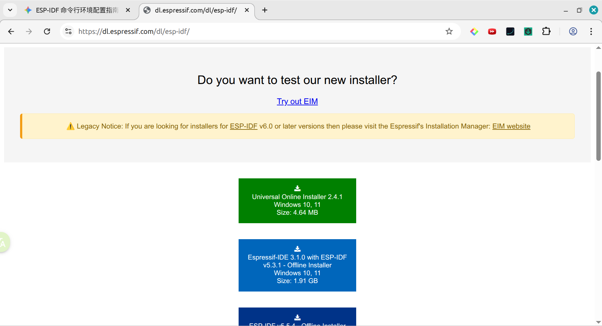

就是这个绿色的吗

### 🤖 Assistant

对，**就是这个绿色的按钮！**
它是“Universal Online Installer”（通用在线安装包）。正如图片里显示的，它本身非常小（只有 4.64 MB），因为它只是一个“下载引擎”。等你运行它之后，它会让你选择需要的版本（推荐选 v5.2）和目标芯片，然后只下载你需要的部分，这是最聪明、最省空间的做法。
（它下面那个蓝色的 1.91 GB 是包含了所有芯片和历史版本的离线包，太臃肿了，咱们不需要。）

### 接下来的操作重点提醒：

1. **下载并双击运行：** 这个绿色的 `.exe` 文件。
2. **死守路径规则：** 安装路径（默认通常是 `C:\Espressif`）和以后你存放代码的文件夹，**绝对不能有中文和空格**。
3. **按需勾选：** 在选择安装组件的页面，记得取消勾选那些你用不到的芯片（比如 RISC-V 系列的 ESP32-C3 等），**只保留 ESP32 和 ESP32-S3**，这样能帮你省下好几个 G 的硬盘空间。

### 回答你上一个问题：Windows 下怎么和 VS Code 完美配合？
其实在 Windows 下的工作流，核心逻辑和咱们在 Linux 聊的一模一样：**VS Code 依然只做纯粹的编辑器，不用安装庞大的官方插件。**
等你安装完上面那个绿色软件后，你的桌面上会出现一个名为 **ESP-IDF X.X CMD**（或者是 PowerShell）的快捷方式。配合 VS Code 的“极客玩法”如下：

1. **先开环境：** 双击桌面上的 `ESP-IDF CMD` 快捷方式，它会弹出一个黑色的命令行窗口。在这个窗口弹出的那一刻，所有的环境（Python、编译器）就已经自动配置好了，不需要像 Linux 那样敲 `get_idf`。
2. **进入项目：** 在这个黑窗口里，用 `cd` 命令进入你的代码目录。例如：`cd C:\my_projects\hello_world`。
3. **一键唤起编辑器：** 在黑窗口里直接输入 `code .` 并回车！
**见证奇迹的时刻：**
通过 `code .` 唤起的 VS Code，会**自动继承**这个黑窗口里的所有环境变量。
此时，你只需要在 VS Code 里按 `Ctrl + \`` 唤出它底部的集成终端，你会发现，你已经可以直接在里面敲`idf.py build`、`idf.py flash` 了！
这样一来，你在 Windows 上的开发体验，就完全还原了那种“底层掌控、清爽干净”的极客工作流。等你装完，我们可以一起跑个 Hello World 试试！

## Turn 7

### 👤 User

*[This turn includes uploaded images]*

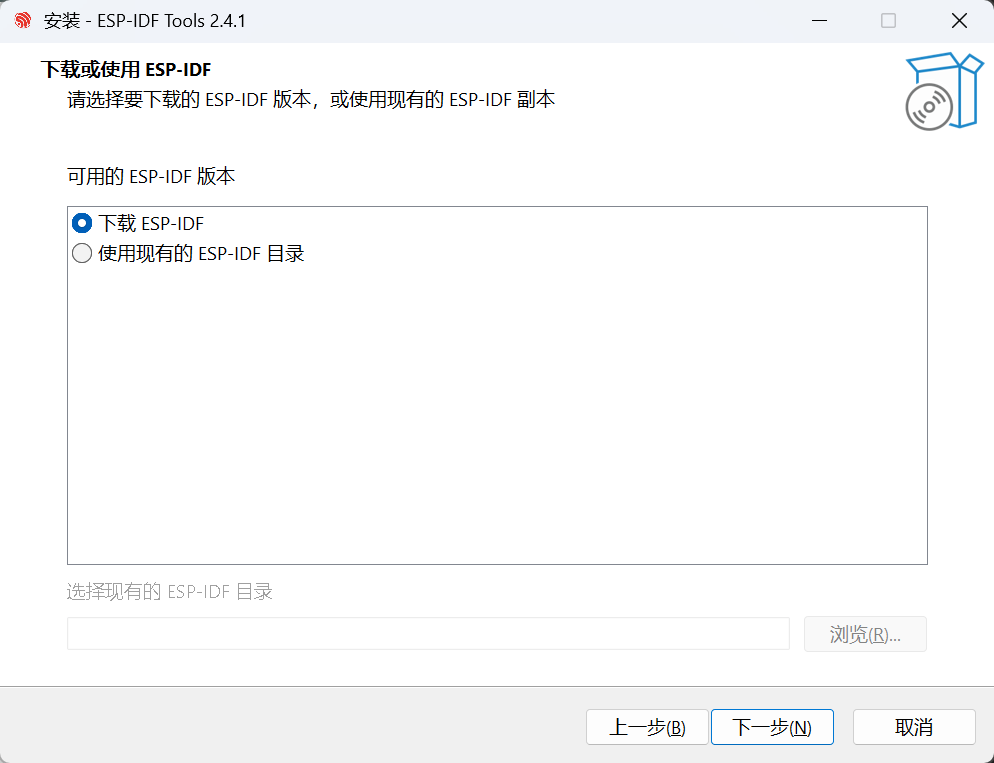

选下载esp-idf?

### 🤖 Assistant

对，非常正确！就选 **“下载 ESP-IDF”**。
因为这是你在 Windows 11 上第一次安装，电脑里还没有乐鑫的源码框架，所以必须让安装包去官方服务器拉取最新的代码。
点击“下一步”之后，马上就会遇到两个关键的选择页面，提前给你划一下重点：

1. **选版本：** 它会弹出一个下拉菜单让你选 ESP-IDF 的版本。建议选择带有 **release/v5.2** （或者 v5.3，只要带 `release` 稳定版字样的就行），千万别选 `master` 分支，那是每天都在变的开发版，容易有 Bug。
2. **选路径（生死攸关的一步）：** 接下来会让你选把 ESP-IDF 装在哪里。**请务必保持路径里绝对没有中文、绝对没有空格！** * 默认通常是 `C:\Espressif` 或者 `C:\Users\你的纯英文用户名\esp`，直接用默认的就好。
  - 如果你 C 盘空间紧张想放 D 盘，可以改成类似 `D:\Espressif` 这样的纯英文无空格路径。
继续往下点吧，遇到拿不准的界面随时截图发我！

## Turn 8

### 👤 User

*[This turn includes uploaded images]*

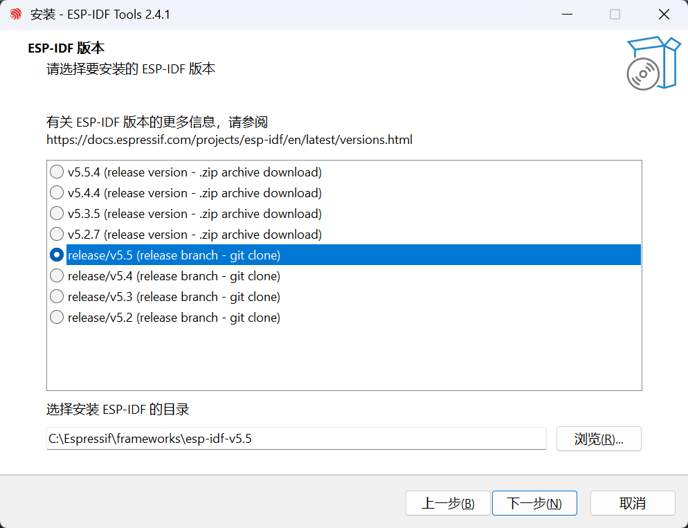

这个？另外放到softwares里可以吗

### 🤖 Assistant

关于版本选择，**我建议你往上稍微看一点，改选 v5.2.7 (release version - .zip archive download)。**
你现在选的这个 `release/v5.5 (git clone)` 包含非常新的特性，但它是一个还在持续合并代码的分支。对于咱们后续要做的电机底层驱动和摄像头移植，选择后面带 **.zip archive download** 的版本（比如 5.2.7）是最硬核、最稳妥的选择。
它是一个经过严格测试且固定不变的“代码快照”，不会像 git clone 分支那样在未来的某天因为拉取了某个新提交而莫名其妙报错。而且，在 Windows 环境下直接下载 zip 压缩包通常比跑 `git clone` 要快得多，能最大程度避免网络波动导致的安装失败。
关于安装路径，**放到 softwares 文件夹里完全可以，这反而是一个极佳的整理习惯！**
你只需要确保修改后的完整路径满足我之前强调的“保命法则”：**绝对没有中文，且绝对没有空格。**

- **完美的路径示范：**`D:\softwares\Espressif` 或 `C:\softwares\Espressif`
- **绝对禁止的路径：**`C:\Program Files\Espressif` （注意到了吗？`Program Files` 中间有个致命的空格，这会让构建系统直接崩溃！）
只要你自定义的路径像 `softwares` 这样是一个纯正的英文连贯单词，你想放在哪个盘都畅通无阻。
改好路径并选好 `.zip` 稳定版后，直接点击下一步，马上就会进入重头戏——**选择要安装的组件和芯片环境**。
接下来我们要大砍一刀，把不需要的环境剔除掉来节省几个 G 的空间。你需要我列出在下一个页面具体应该保留哪几个勾选项吗？

## Turn 9

### 👤 User

*[This turn includes uploaded images]*

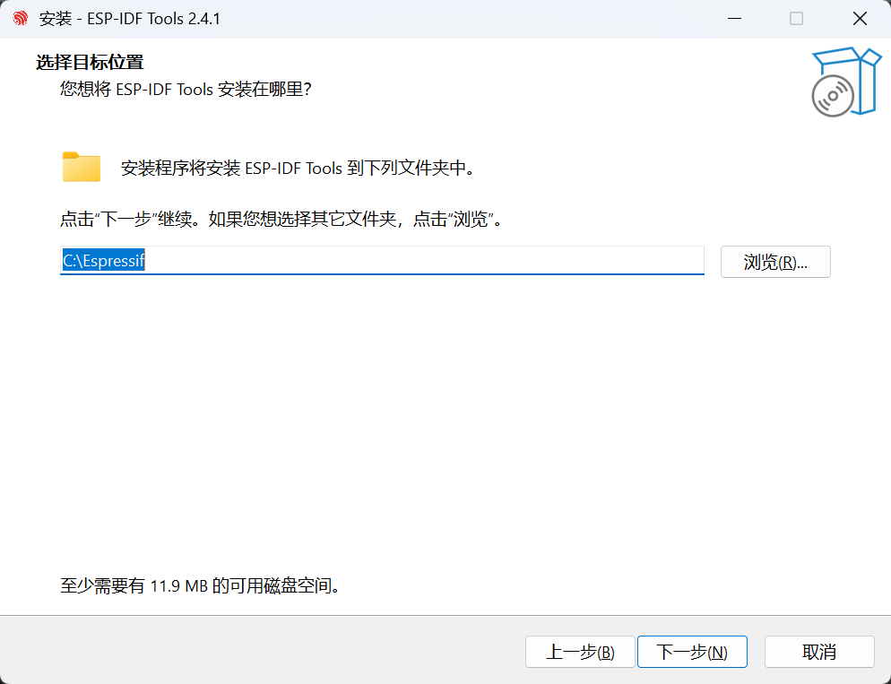

我上一步放在了D:\softwares\ESPIDF，那这个呢，在ESPIDF文件夹里再建一个Espressif？还是在D:\softwares里建一个Espressif

### 🤖 Assistant

建议直接放在 **D:\softwares\Espressif** （也就是和你的 `ESPIDF` 文件夹并列平级）。
千万不要把它套在 `ESPIDF` 文件夹里面。原因很简单，这两个路径装的是完全不同类型的东西：

1. **上一步的 ESPIDF 文件夹：** 装的是乐鑫的**官方源码框架**（C/C++ 代码、头文件、RTOS 底层库等）。
2. **这一步的 ESP-IDF Tools 文件夹：** 装的是**底层干活的工具**（比如用来把代码变成单片机认识的机器码的交叉编译器、Python 虚拟环境、代码烧录工具等）。
把“源码”和“工具”分开存放是最清爽、最标准的文件管理方式。未来如果你需要升级或者重装不同版本的源码包，就不会不小心把这堆编译工具也给删了。
所以，在这个框里直接填入 `D:\softwares\Espressif`，然后点击下一步。接下来就会进入我们刚才说的“砍组件省空间”的页面了，遇到那个页面截图给我，我帮你挑需要保留的选项。

## Turn 10

### 👤 User

*[This turn includes uploaded images]*

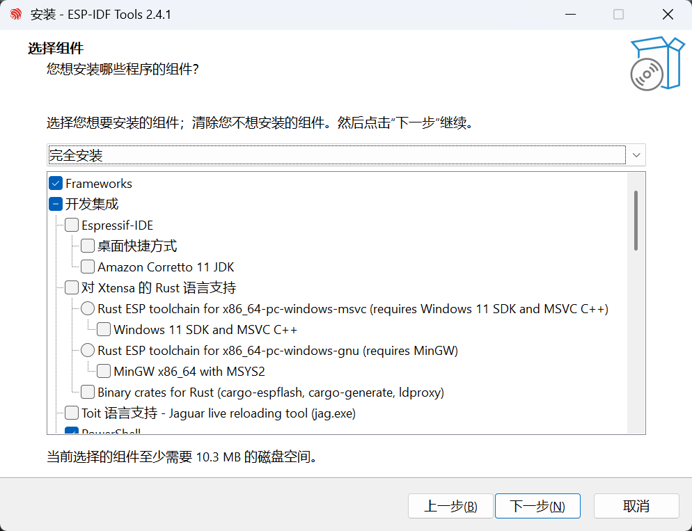

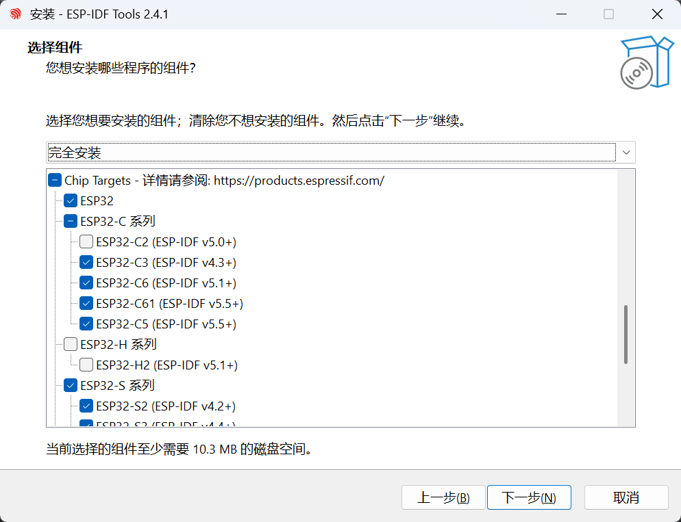

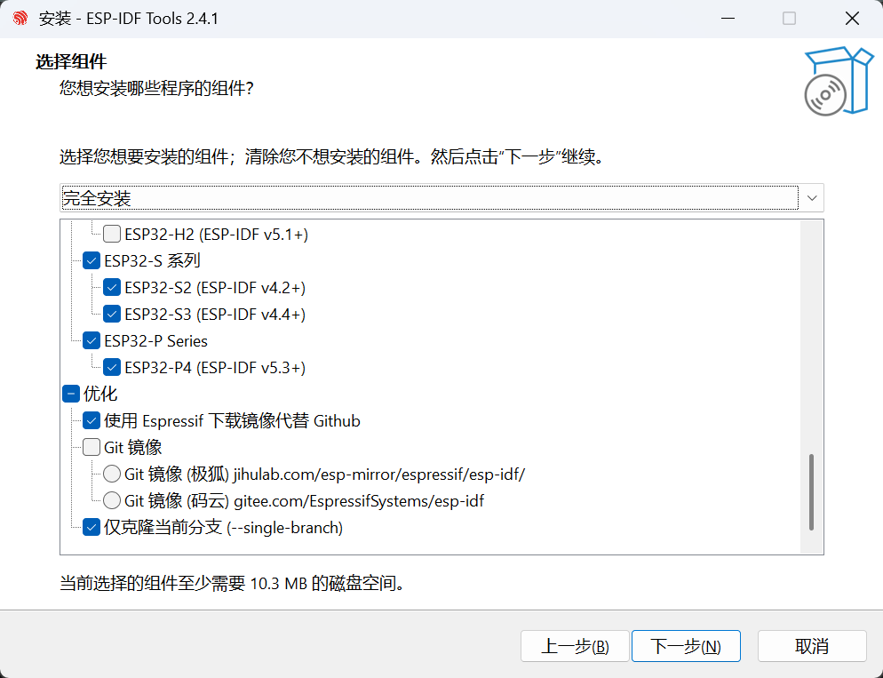

你应该可以看到吧

### 🤖 Assistant

看得很清楚。这个页面就是我们给硬盘“大减负”的关键环节。
你现在的勾选状态包含了很多你用不到的芯片工具链（比如 RISC-V 架构的 C 系列）。为了保持环境的纯粹并最大限度节省空间，请按照以下方案进行调整：
**1. 开发集成 (图1)：保持原样**
什么都别勾。不要选 `Espressif-IDE`，也不要选 `Rust` 语言支持。咱们后续直接用 VS Code + 命令行，完全不需要这些额外的 IDE 负担。
**2. Chip Targets (芯片目标 - 图2和图3)：大砍一刀**
这里是省空间的核心：

- **保留** 最上面的 `ESP32`。
- **取消勾选** 整个 `ESP32-C 系列`（点一下前面的蓝底白勾，让它变成空白）。这会帮你省掉一整套 RISC-V 的交叉编译工具链。
- 展开 `ESP32-S 系列`，**只保留 ESP32-S3**，把 `ESP32-S2` 取消掉。
- **取消勾选** 最下面的 `ESP32-P Series` (P4)。
**3. 优化 (图3)：保持原样**

- **使用 Espressif 下载镜像代替 Github**：这个选项**极其重要，千万保持勾选！** 它能确保安装程序走国内的 CDN 节点，让你几分钟就能下完几个 G 的工具链，否则走 Github 直连很可能会半路断开报错。
- `仅克隆当前分支 (--single-branch)`：保持勾选，这能避免下载庞大且无用的 Git 历史记录。
调整完毕后，你的芯片目标里应该**只有 ESP32 和 ESP32-S3 是亮着的**。确认无误后，直接点击“下一步”，就可以安心等进度条跑完了。

## Turn 11

### 👤 User

有一个问题，之前那个性能低一些的espcam在platformIO创建工程时填的是“AI Thinker ESP32-CAM”，这是哪个系列

### 🤖 Assistant

那个大名鼎鼎的“AI Thinker ESP32-CAM”（安信可出品），它其实就属于最经典、最基础的 **ESP32** 系列。
在刚才的安装界面里，你保留了最上面的 `ESP32` 勾选项，这就**完美覆盖**了这块板子，你不需要再回头去勾选任何其他选项了。
稍微梳理一下这块板子的底层逻辑，你就更清晰了：

1. **核心芯片没变：** 所谓的 AI Thinker ESP32-CAM，其实就是把一颗普普通通的老款 ESP32 芯片（通常是双核的 ESP32-D0WDQ6），和一颗 4MB 的 PSRAM（外部伪静态内存），外加一个 SD 卡槽和一个摄像头接口，强行挤在了一块小板子上。它本质上依然是 ESP32。
2. **为什么你感觉它“性能低”：** 经典版的 ESP32 其实**并没有**专用的摄像头硬件外设。乐鑫当年为了让它能接摄像头，玩了个极其硬核的“极客操作”：强行把音频接口（I2S 总线）配置成并行接收模式，用搬运音频数据的 DMA 去兼职搬运摄像头的图像数据。这种“强扭的瓜”虽然解渴，但在高分辨率和高帧率下，自然会显得非常吃力。
3. **与你现在的 ESP32-S3 视觉核心的对比：** 你们课程要求视觉板用 **ESP32-S3** 是非常明智的升级。因为 S3 芯片在硅片物理层面，就专门划出了一块叫 `LCD_CAM` 的硬件外设来专门对口摄像头和屏幕，甚至还加入了用来加速图像和 AI 运算的向量指令集（PIE）。
所以，你现在的环境配置（保留 `ESP32` 和 `ESP32-S3`）是非常精准的：既能用来写经典 ESP32 的电机运动控制，也能用来写 S3 的高性能视觉识别。放心让进度条往下跑吧！

## Turn 12

### 👤 User

*[This turn includes uploaded images]*

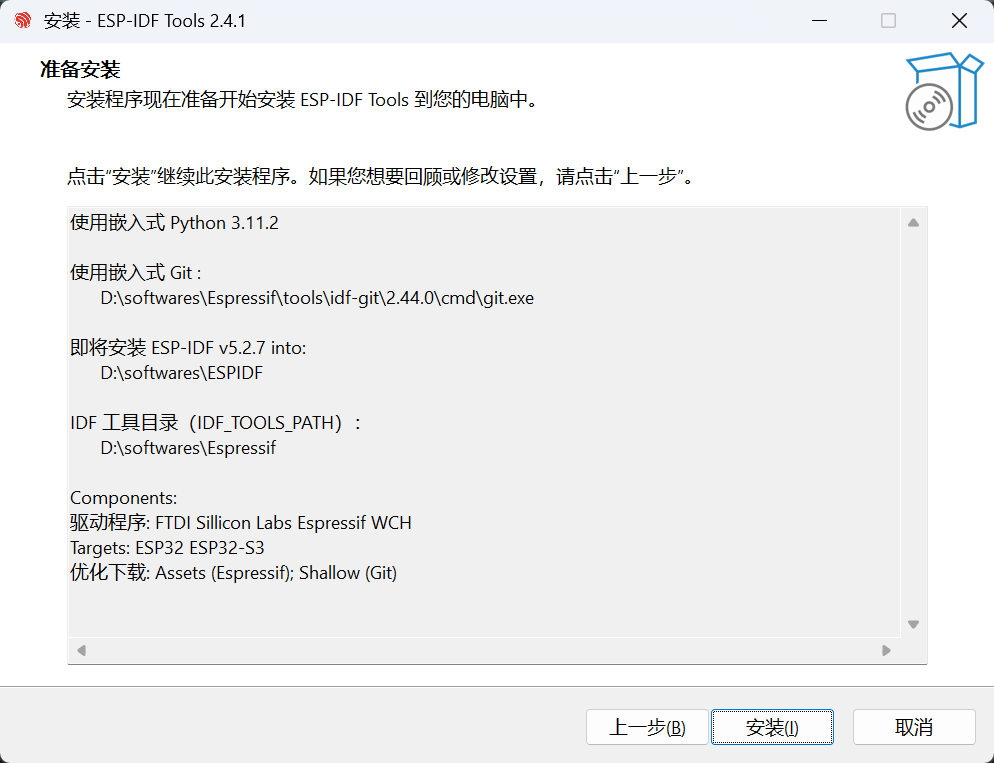

没问题吧，话说什么叫嵌入式git，是为了避免弄脏git环境吗？可git又不是python，也会被弄脏环境？

### 🤖 Assistant

**完美！这份安装清单可以打满分。**
路径干干净净（没有中文和空格），框架和工具链相互独立（`ESPIDF` 和 `Espressif` 分开存放），芯片只保留了我们需要的 ESP32 和 ESP32-S3，并且开启了国内镜像加速。
你可以放心地点击“安装”了。

### 关于你敏锐的提问：为什么要用“嵌入式 Git”？
你的直觉非常准，Git 确实不像 Python 那样存在“第三方包版本冲突”导致环境被弄脏的问题。乐鑫在这里坚持自带一个“嵌入式 Git”，主要是在防范另外几个深坑：

1. **防范“全局配置”污染（最致命的一点）：**
虽然 Git 没有依赖包，但每个开发者的电脑里都有一个全局的 `.gitconfig` 配置文件。在 Windows 下，很多开发者会开启换行符自动转换（`core.autocrlf = true`），或者设置了奇奇怪怪的全局 HTTP 代理、SSL 证书忽略等。
ESP-IDF 包含了海量的底层 C 源码和第三方子模块（比如 FreeRTOS），如果被你系统里原来的 Git 按照全局规则强行把换行符或者编码改了，编译时就会报出成百上千个极其诡异的语法错误。自带嵌入式 Git，就是为了拥有一个**完全纯净、不受你全局配置干扰**的独立下载引擎。
2. **锁定版本，拒绝玄学 Bug：**
有些用户的电脑上可能安装的是五六年前的古董级 Git，或者是一些精简版的 Git 客户端。ESP-IDF 的安装脚本里用到了很多高级的 Git 指令来递归拉取子模块。为了保证 100% 的安装成功率，乐鑫干脆自己打包一个经过他们全面测试的特定版本 Git（如图中的 `v2.44.0`）。
3. **开箱即用（Zero-Dependency）：**
这样做也保证了即使是一台刚刚装好 Windows 11，什么开发工具都没装过的“裸机”，也能直接靠这个安装包一键配好环境，不需要用户再单独去官网下 Git。
总结来说，**Python 的虚拟环境是为了隔离“代码依赖”，而嵌入式 Git 是为了隔离“操作习惯和系统环境”。**
点击“安装”后可以去喝杯水了，因为即使走了国内镜像，解压这几个 G 的工具链和几十万个碎文件也需要一点时间。等进度条彻底跑完，我们就可以在 VS Code 里点亮你的第一行代码了！

## Turn 13

### 👤 User

*[This turn includes uploaded images]*

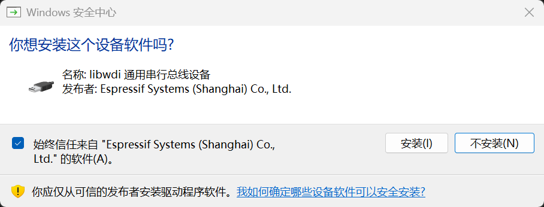

这里无脑信任就完事了吧

### 🤖 Assistant

对，直接“无脑信任”点安装就行！
这是乐鑫官方（Espressif Systems）签名的底层 USB 驱动（libwdi）。
**为什么要装这个？**
你将要用到的 ESP32-S3 芯片有一个非常强大的特性：它内置了原生的 USB 功能（USB JTAG/Serial）。这意味着它不需要像以前的老单片机那样依赖板载的 CH340 或 CP2102 等串口转换芯片，可以直接通过 USB 线和你的电脑进行高速通信。
安装这个驱动后，你的 Windows 11 才能正确识别这根“原生 USB 管道”，从而实现后续的代码烧录、串口日志打印，甚至是在 VS Code 里进行硬件断点调试。
勾选“始终信任”也是正确的操作，这样以后你插拔不同型号的乐鑫开发板，它就不会每次都弹出来烦你了。点完安装，环境配置就基本大功告成了！

## Turn 14

### 👤 User

*[This turn includes uploaded images]*

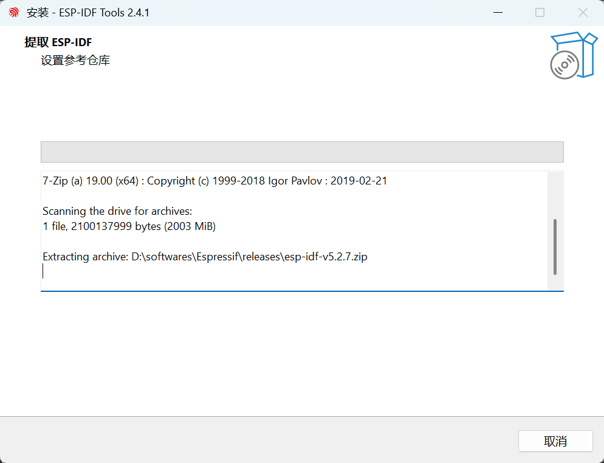

这是在等我吗

### 🤖 Assistant

不是在等你，它正在后台疯狂干活呢！千万别点取消。
这个时候看似卡住了，光标停在 `Extracting archive...` 这里一动不动，其实是因为它正在调用 7-Zip 解压那个高达 2GB（2003 MiB）的核心源码包。
**为什么会感觉卡住了？**
ESP-IDF 框架里面包含了 FreeRTOS、各类底层协议栈和海量的 C/C++ 源码。这些全都是几 KB 的“细碎小文件”，总数高达几十万个。在 Windows 的 NTFS 文件系统下，连续解压并创建几十万个碎文件的 I/O 压力非常大，耗时很长，即使你是高速固态硬盘，界面也会显得像停滞了一样。
你现在唯一要做的就是**耐心等待**。根据电脑硬盘性能不同，这一步可能需要 5 到 15 分钟不等。趁这个时间刚好可以去转一圈休息一下，等它把这几十万个文件全部铺进你的 `D:\softwares\ESPIDF` 文件夹里，进度条自己就会继续往下跑了。

## Turn 15

### 👤 User

现在需要网吗，不需要的话我把热点关了省省电

### 🤖 Assistant

**千万别关网！现在还不能断开连接。**
虽然它现在看似只是在本地解压文件，但在解压完成之后，它**还需要继续联网下载大量核心组件**。

### 为什么还需要网？
你刚才下载运行的只是一个 4MB 的“在线安装引擎”，它目前的进度只是把乐鑫的**源码框架**（那 2GB 的压缩包）拉下来并解压了。
等源码解压铺设完毕后，它马上会进入下一个阶段，去服务器拉取“干活的工具”：

- **交叉编译工具链：** 专门用来把你的 C/C++ 代码编译成 ESP32 和 ESP32-S3 认识的机器码的编译器（比如 `xtensa-esp-elf-gcc`）。
- **独立的 Python 环境与依赖包：** ESP-IDF 的构建系统严重依赖 Python，它会在本地为你搭建一个隔离的虚拟环境，并用 `pip` 联网下载一系列必需的第三方库。
- **烧录与调试工具：** 比如用于程序的烧录工具和硬件断点调试的 OpenOCD 等。
这些工具包加起来也有好几百兆。如果在这个时候断开热点，安装脚本在下一步就会因为无法建立网络连接而直接报错退出，那你前面漫长的解压等待就前功尽弃了。
为了避免安装翻车，**请务必保持热点连接，直到安装向导彻底跑完，出现带有“完成 (Finish)”按钮的最终界面。** 趁这个时间可以给手机插上充电器回回血！

## Turn 16

### 👤 User

*[This turn includes uploaded images]*

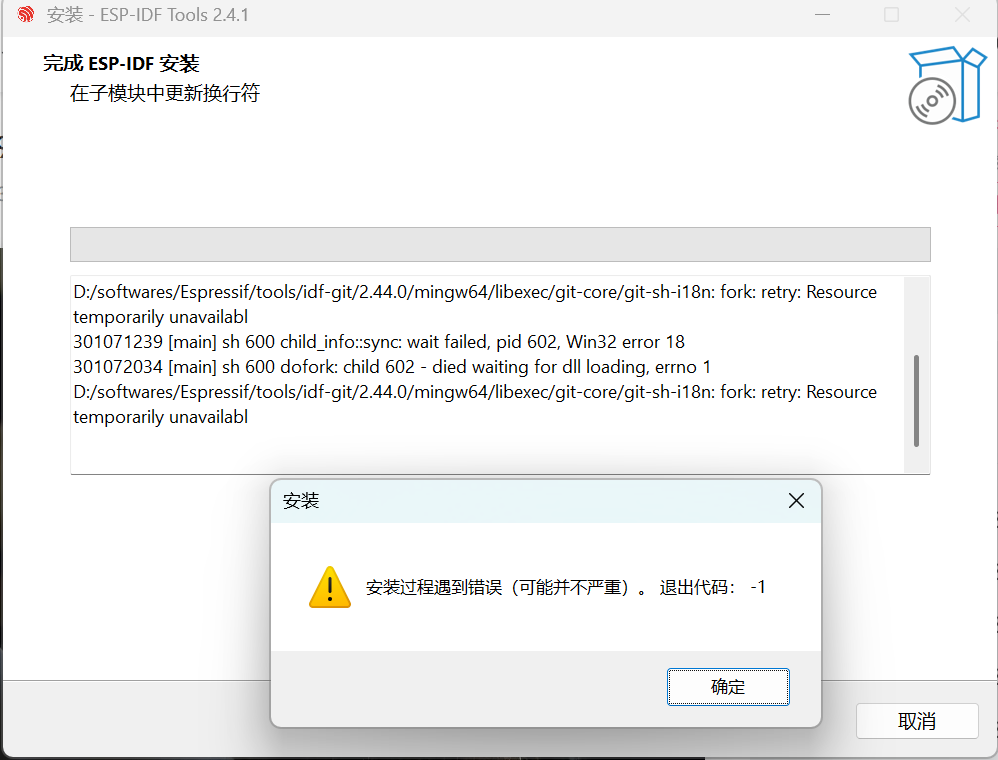

靠

### 🤖 Assistant

太搞心态了，进度条都走到最后 99% 了给你来这出。完全理解你想砸键盘的心情！不过先别慌，深呼吸。
正如弹窗里它自己心虚承认的那样——**“（可能并不严重）”**。其实你的安装大概率已经成功了。

### 到底发生了什么？
注意看后面那个背景窗口里的报错核心：`fork: retry: Resource temporarily unavailable` 和 `died waiting for dll loading`。
这其实不是你的问题，这是在 Windows 环境下做底层开发经常遇到的一个“历史遗留大坑”。刚才我们夸过的那个“嵌入式 Git”，它的底层依赖于一个叫 MSYS2 的 Linux 模拟环境。在安装的最后一步（背景里写的“在子模块中更新换行符”），Git 试图在瞬间拉起成百上千个子进程（`fork` 操作）去批量扫描并修改那几十万个源码文件的回车换行符。
Windows 的底层机制处理这种瞬间海量并发极其吃力，再加上 Windows Defender（安全中心）可能觉得这个行为很像病毒，瞬间介入扫描，直接导致 Git 的进程因为等不到系统资源分配而崩溃了。

### 接下来怎么做？
所有的重头戏——那几个 G 的核心代码、交叉编译器、Python 环境，早就已经完好无损地躺在你的 `D:\softwares` 里了。这只是最后打扫战场时扫帚断了而已。

1. **直接点“确定”：** 把这个报错弹窗关掉，让安装向导正常退出。
2. **去桌面找快捷方式：** 直接去你的 Windows 桌面上找一下，看看有没有多出来一个黑色的、名字类似 **ESP-IDF 5.2 CMD**（或者 PowerShell）的快捷方式图标。
3. **开箱验货：** 双击打开那个快捷方式。
如果在弹出的黑窗口里跑过一串路径加载信息后，最后稳稳地停在类似 `Done! You can now compile ESP-IDF projects.` 并在下面出现了等待你输入命令的光标，**那就说明我们的环境完全是好的，前面所有的心血都没白费！**
快去桌面看看那个黑色的快捷方式在不在？如果打开后有报红，我们也不需要重新下载，我教你进文件夹敲一行修复命令就能搞定。

## Turn 17

### 👤 User

*[This turn includes uploaded images]*

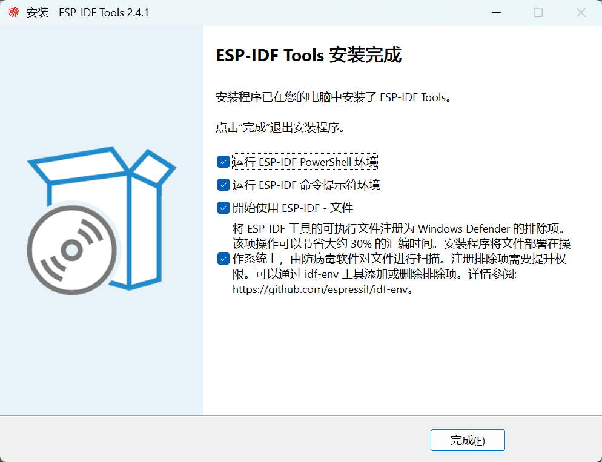

选这些？

### 🤖 Assistant

建议稍微调整一下，不要全选，这样最清爽：

- **取消勾选**前三个选项（PowerShell、命令提示符、文件）。因为你的桌面已经自动生成了快捷方式，咱们一会儿直接从桌面启动来配合 VS Code，不需要它现在立刻弹出一堆黑窗口和网页文档。
- **务必保持勾选**最后一个选项（“将 ESP-IDF 工具的可执行文件注册为 Windows Defender 的排除项”）。
**为什么最后一个选项极其重要？**
刚才咱们聊过 Windows 编译比 Linux 慢的问题，罪魁祸首之一就是 Windows 的自带杀毒软件（Defender）。Ninja 构建系统在并发编译时会瞬间产生海量的临时小文件，如果杀毒软件强行介入逐一扫描，不仅会把编译速度拖慢几倍，还会导致进程阻塞（刚才你遇到的报错，大概率就是它突然拦截引发的资源枯竭）。
保留这个勾选，乐鑫的脚本会自动帮你的编译工具链申请一张“免检查通行证”，能稳稳提升 30% 以上的编译速度。
点“完成”后，系统会弹出一个要求管理员权限的提示窗（因为它要修改底层的安全中心设置），直接点“是”放行即可。搞定后，就可以去桌面找那个名为 **ESP-IDF 5.2 CMD** 的快捷方式验货了！

## Turn 18

### 👤 User

但说起来真的有必要吗，我windows defender早就禁用了还是删了来着，不过我已经点了完成了，就这样吧。我在桌面打开ESP-IDF 5.2 CMD(应该打开它还是打开ESP-IDF 5.2 PowerShell呢)，它显示：
Setting PYTHONNOUSERSITE, was not set
Using Python in D:\softwares\Espressif\python_env\idf5.2_py3.11_env\Scripts\
Python 3.11.2
Using Git in D:\softwares\Espressif\tools\idf-git\2.44.0\cmd\
git version 2.44.0.windows.1
Checking Python compatibility
Setting IDF_PATH: D:\softwares\ESPIDF
Adding ESP-IDF tools to PATH...
Not using an unsupported version of tool cmake found in PATH: 4.2.3.
WARNING: The following issue occurred while accessing the ESP-IDF version file in the Python environment: [Errno 2] No such file or directory: 'D:\\softwares\\Espressif\\python_env\\idf5.2_py3.11_env\\idf_version.txt'. (Diagnostic information. It can be ignored.)
D:\softwares\Espressif\tools\xtensa-esp-elf-gdb\16.3_20250913\xtensa-esp-elf-gdb\bin
D:\softwares\Espressif\tools\xtensa-esp-elf\esp-13.2.0_20250707\xtensa-esp-elf\bin
D:\softwares\Espressif\tools\esp-clang\16.0.1-fe4f10a809\esp-clang\bin
D:\softwares\Espressif\tools\riscv32-esp-elf\esp-13.2.0_20250707\riscv32-esp-elf\bin
D:\softwares\Espressif\tools\esp32ulp-elf\2.35_20220830\esp32ulp-elf\bin
D:\softwares\Espressif\tools\cmake\3.30.2\bin
D:\softwares\Espressif\tools\openocd-esp32\v0.12.0-esp32-20260304\openocd-esp32\bin
D:\softwares\Espressif\tools\ninja\1.12.1\
D:\softwares\Espressif\tools\idf-exe\1.0.3\
D:\softwares\Espressif\tools\ccache\4.12.1\ccache-4.12.1-windows-x86_64
D:\softwares\Espressif\tools\dfu-util\0.11\dfu-util-0.11-win64
D:\softwares\ESPIDF\tools
Checking if Python packages are up to date...
Constraint file: D:\softwares\Espressif\espidf.constraints.v5.2.txt
Requirement files:
- D:\softwares\ESPIDF\tools\requirements\requirements.core.txt
Python being checked: D:\softwares\Espressif\python_env\idf5.2_py3.11_env\Scripts\python.exe
Python requirements are satisfied.
Done! You can now compile ESP-IDF projects.
Go to the project directory and run:
idf.py build
D:\softwares\ESPIDF>

### 🤖 Assistant

恭喜！看到最后那句 **Done! You can now compile ESP-IDF projects.**，就说明这最难啃的一块骨头已经被你彻底拿下了，环境已经**完美配置成功**！
针对你的几个小疑问，我先快速解答一下：

1. **Defender 禁用的问题：** 没关系，既然已经禁用了，安装程序申请白名单那一步就相当于“走个过场”，对结果没有任何负面影响。
2. **CMD 还是 PowerShell：** 选哪个都可以。它们的作用仅仅是提供一个外壳，底层调用的环境变量是完全一样的。既然你打开了 CMD 并且一切正常，以后就默认用这个 `ESP-IDF 5.2 CMD` 快捷方式就好，它比 PowerShell 启动还要快一点点。
3. **中间的那个 WARNING：** 注意看括号里的话 `(Diagnostic information. It can be ignored.)`。这只是 Python 虚拟环境在诊断时没找到一个版本号缓存文件而已，完全不影响核心工具链的运行，直接无视它。

### 下一步：在 VS Code 里跑通第一个项目
现在你的终端正停留在 `D:\softwares\ESPIDF>` 这个框架源码目录里。**我们绝对不能直接在这个官方源码文件夹里写代码**。你需要建立一个专门存放自己代码的工作区，并把官方的 `hello_world` 示例复制过去。
请在这个黑窗口里，依次执行以下几条命令：
**1. 创建你的专属工程目录（例如建在 D 盘根目录下）**

```dos
mkdir D:\esp_projects

```
**2. 把官方的 Hello World 示例连同其 CMake 配置完整复制过来**

```dos
xcopy /E /I D:\softwares\ESPIDF\examples\get-started\hello_world D:\esp_projects\hello_world

```
**3. 进入你刚刚创建的工程目录**

```dos
cd /d D:\esp_projects\hello_world

```
**4. 见证奇迹：一键唤起 VS Code**

```dos
code .

```
回车之后，VS Code 就会瞬间弹出来，并且**自动继承了这套复杂的 ESP-IDF 编译环境**。在这个 VS Code 窗口里，你可以按下 `Ctrl + \`` 打开底部的集成终端，你会发现你可以直接在里面使用`idf.py` 命令了，完全回归了清爽的极客工作流。
你的 ESP32-S3 开发板现在连上电脑了吗？需要我现在带你在 VS Code 里直接编译并烧录这个项目吗？

---

*Exported from [Voyager](https://github.com/Nagi-ovo/gemini-voyager)*  
*Generated on June 10, 2026 at 09:32 AM*